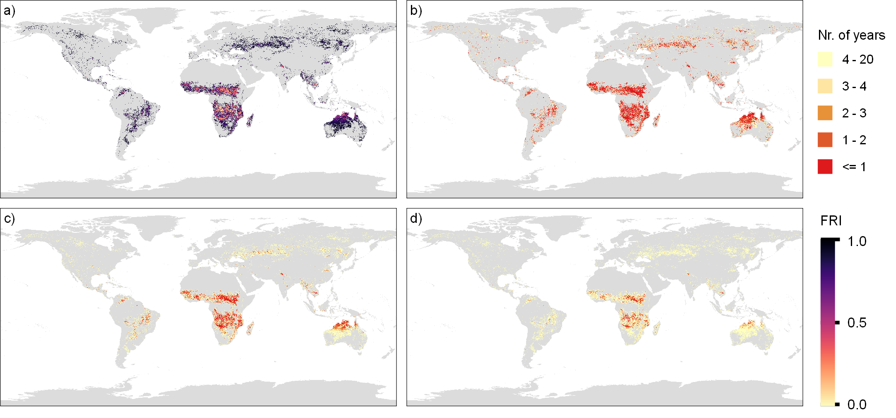

### Description
<p align="justify">
This package provides an algorithm to characterize global fire regimes using fire occurence data from Google Earth Engine. Given a list of years, the algorithm will derive annual maps of fire occurrences, depicting per-pixel counts of months with active fires. These annual layers are then used to compute a series of metrics that characterize the temporal recurrence of fires:
</p>

<br>

* <i>Fire Return Interval (FRI) - </i>Mean number of years between fires
* <i>Min. return time (MRI1) - </i>Minimum between-burn interval
* <i>Mean return time (MRI2) - </i>Mean between-burn interval
* <i>Maximum return time (MRI3) - </i>Maximum between-burn interval

<br>
<p align="justify">
The FRI is expressed as the quotient between the number of years with fires and the number of years in the time-series. Then, for each pixel, fire map uses Running Length Encoding (RLE) to break a time-series of fire occurrences (with 1 for "fire" and 0 for "unburnt") into segments of equal value. The length of segments corresponding to "unburnt" periods are used to calculate MRI1, MRI2, and MRI3. The algorithm relies on global burned area maps derived monthly at a resolution of 500-m based on MODIS. For details on this data, <a href="https://developers.google.com/earth-engine/datasets/catalog/MODIS_006_MCD64A1">refer to the GEE's data catalog</a>.
</p>

<br>


<p align='center'>Global differences between <i>IFRI</i> (a), <i>MRI1</i> (b), <i>MRI2</i> (c), and <i>MRI3</i> (d)</p>

<br>

### How to use
<p align="justify">
<i>firemap</i> is not currently in PyPI, and therefore should be installed manually. To do so, please download the current repository as a zip file and use 
</p>
<br>

```python
pip install firemap.zip
```

<br>

### Requirements.
<p align="justify">
When installed, the package will also install needed dependencies. However, given the algorithm uses GEE, some configuration work is inposed on the user. Specifically, one should follow the <a href="https://www.earthdatascience.org/tutorials/intro-google-earth-engine-python-api/">GEE api configuration tutorial<a/> to setup access to data and computational resources.
</p>

<br>

### Desclaimer
<p align="justify">
Note: the algorithm was designed to download data with a maximum resolution of 1-km, which is limited by the quota imposed by GEE on the size of files that can be directly downloaded after processing. Applying this algorithm at finer resolutions will require changes to the gee_download() function.
</p>
